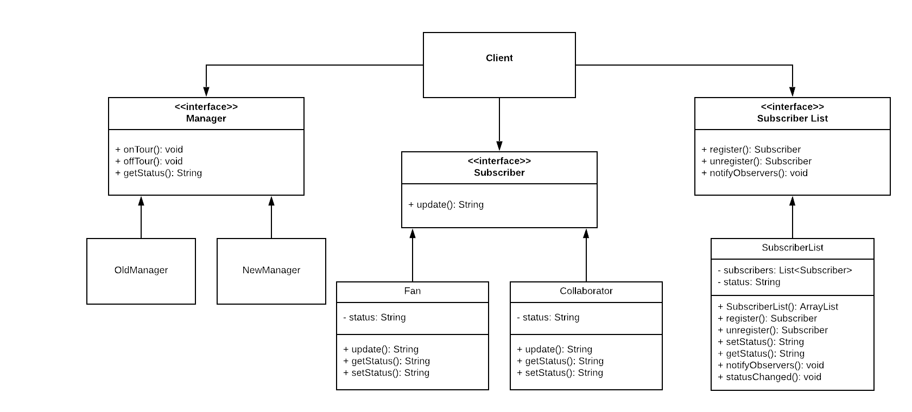

# COMP 373 - Musician Tours

## Summary
For this project, we have implemented the Observer and Bridge patterns using the idea of Musicians on Tour. 

### How to Run:
1. Open project in Eclipse, IntelliJ, or any Java IDE.
2. Run as a "Java application" in order to view what prints from the Client side and see which artists are on tour. 

### Testing: 
We are using JUnit for running tests. Make sure to have JUnit imported in your local environment in order to run the tests. 

## Specifications 
System Name: Musician Tours

System Design: We designed a system for Musicians to be tracked as to when they are on tour and who they are going on tour with. The system allows the Musician's Manager to take control and manage when the Musician goes on tour and is not touring, thus using the Bridge pattern. It also watches who the subscribers are of the Artists themselves: i.e. Fans or actual Collaborators. Different subscribers would then get notified and have the knowledge of when a certain Artist is touring, making use of the Observer Pattern.

Patterns Used: Bridge and Observer

## UML Diagram

